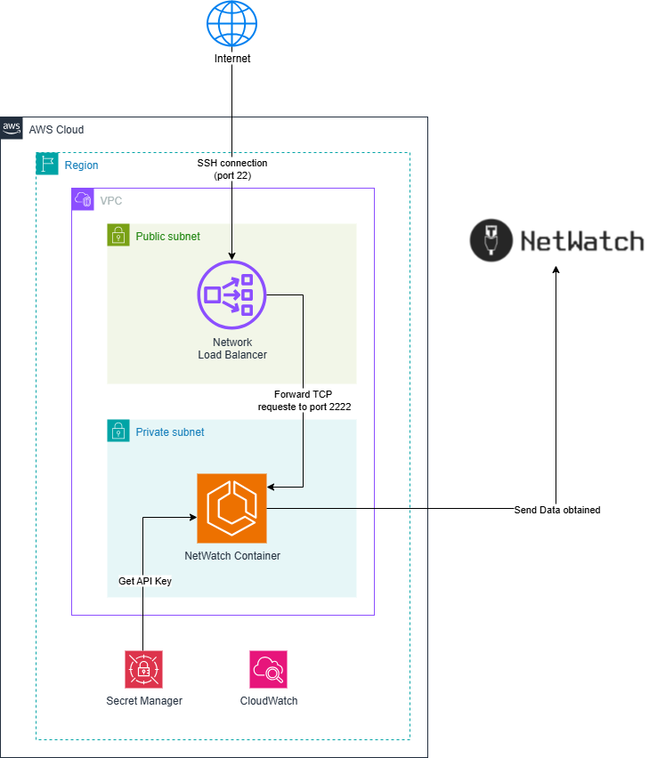

# NetWatch

This article intends to guide how to deploy NetWatch SSH-AttackPod container in AWS ECS Fargate.

For more documentation about the NetWatch SSH-AttackPod please visit https://github.com/NetWatch-team/SSH-AttackPod

# Overview

This deployment guide outlines the process of deploying the NetWatch container on AWS ECS Fargate with SSH service exposure through a Network Load Balancer.

## Architecture

  * Container Platform: AWS ECS Fargate
  * Load Balancer: Network Load Balancer (NLB)
  * Service: SSH access via containerized NetWatch application

## High Level Design Architecture



## Configuration Changes

### Docker Compose Limitations

The original *docker-compose.yml* from the repository cannot be used to start the container in Fargate and that creates a privilege issue to start the service with the default port 22 for SSH. The port 22 is not feasible in this environment, we use then the port 2222.

### SSH Port Modification

To address the port binding limitations, the Dockerfile has been modified to configure SSH on port 2222 instead of the default port 22. This change is implemented by updating the SSH daemon configuration file:

File Modified: */etc/ssh/sshd_config*
Change: SSH port configured to 2222 during Docker image build process

### Load Balancer Configuration

The Network Load Balancer is configured to:

   - **Frontend:** Accept incoming connections on port 22 from everywhere
   - **Backend:** Forward traffic to Target Groups on port 2222 (from 22 to 2222)
   - **Target Groups:** Route requests to the containerized SSH service running on port 2222

# Deploy Infrastructure Step

 1. Clone the repository and go inside the terraform folder.

```bash
git clone https://github.com/terraform-aws-modules/terraform-aws-vpc.git
cd terraform
```

 2. The Terraform variables are defined in the file *terraform.tfvars* and the deploy will follow some steps:
    - Edit variables according your setup:
      - *region:* AWS Region to deploy the service
    - Deploy the mandatory infrastructure controlled by the variable *mandatory_requirements*
    - Build and upload the Docker image with the [SSH Port Modification](#ssh-port-modification) to the AWS ECR repository
    - Edit the AWS Secret Manager created in the mandatory requirements to store the API Key. This key will be used to send the access activity to central NetWatch collector
    - Change the variable *service_enabled* to **true** and finish the deployment

 3. Initialize Terraform

```bash
terraform init
terraform plan
terraform apply
```

 4. From your local console build the image and upload it to the AWS ECR repository created in the preview step

```bash
docker build -t netwatch_ssh-attackpod:9.6-port2222 .
```

   - You can get the following commands from the AWS ECR repository to authenticate and upload the image.

```bash
aws ecr get-login-password --region eu-central-1 | docker login --username AWS --password-stdin <AWS-ACCOUNT-ID>.dkr.ecr.eu-central-1.amazonaws.com

docker tag netwatch_ssh-attackpod:9.6-port2222 <AWS-ACCOUNT-ID>.dkr.ecr.eu-central-1.amazonaws.com/netwatch_ssh-attackpod:9.6-port2222

docker tag netwatch_ssh-attackpod:9.6-port2222 <AWS-ACCOUNT-ID>.dkr.ecr.eu-central-1.amazonaws.com/netwatch_ssh-attackpod:latest

docker push <AWS-ACCOUNT-ID>.dkr.ecr.eu-central-1.amazonaws.com/netwatch_ssh-attackpod:9.6-port2222

docker push <AWS-ACCOUNT-ID>.dkr.ecr.eu-central-1.amazonaws.com/netwatch_ssh-attackpod:latest
```

 5. From AWS Web Console go to the **AWS Secret Manager**, select the secret related to this deploy and **Edit** the secret value. After this has been updated, the docker container will have the secret available as an environment variable *NETWATCH_COLLECTOR_AUTHORIZATION*.

 6. Having now uploaded the Docker image, we can enable the variable *service_enabled* to **true** and run again the terraform.
    - **Note:**
      - the docker image *tag* is hard coded as *latest* to start the container
      - you can change it in the container definition in the file *ecs_container_netwatch.tf*

```bash
terraform apply
```

 7. When the deployment is finished check the Load Balancer DNS name in the terraform outputs. This DNS name is the entrypoint to access/test the service.
